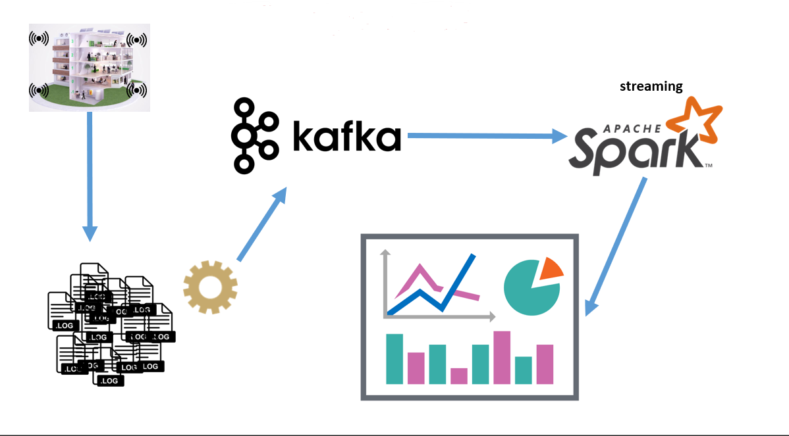
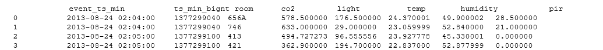
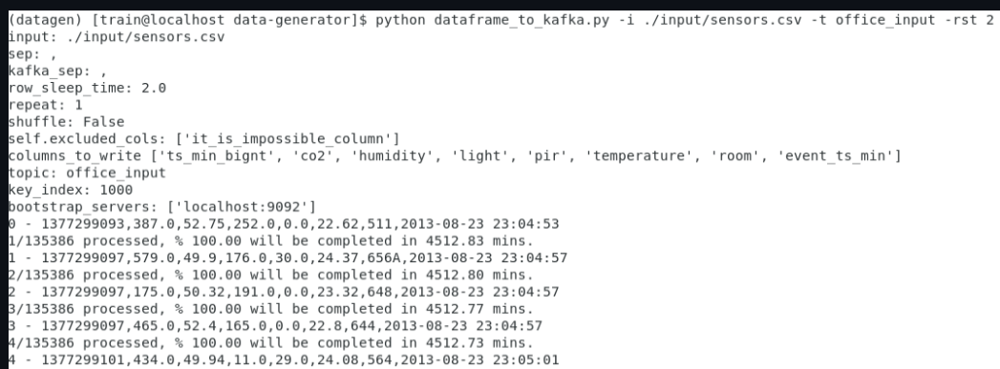
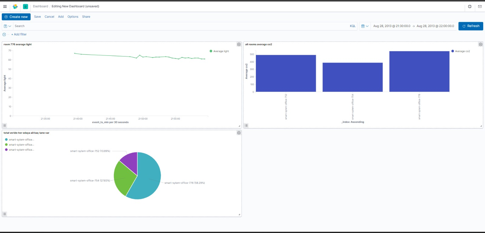

# Streaming Data Processing

## 1)Used Technologies and Services

- Apache Airflow
- Apache Zookeeper
- Apache Kafka
- Apache Hadoop HDFS
- Apache Spark (PySpark)
- Apache Hadoop YARN
- Elasticsearch
- Kibana
- Docker

---
- OS: Centos7
- IDE: PyCharm, VSCode

## Overview

- Take a compressed data source from a URL
- Process the raw data with **PySpark**, and use **HDFS** as file storage, check resources with **Apache Hadoop YARN**.
- Use **data-generator** to simulate streaming data, and send the data to **Apache Kafka**.
- Read the streaming data from Kafka topic using **PySpark (Spark Streaming)**.
- Write the streaming data to **Elasticsearch**, and visualize it using **Kibana**.




## Steps of the Project

- We should have Apache Kafka, Apache Spark, Apache Hadoop installed locally. Elasticsearch and Kibana can be used via docker-compose.yaml.


- All scripts were written according to my local file/folder locations. But all mentioned scripts can be found in this repo.

To make **Apache Airflow, Docker, Apache Hadoop, Apache Kafka and Apache Zookeeper** available, we should run the following commands (This step may differ on how we installed these locally):
```bash
sudo systemctl start docker
sudo systemctl start airflow
sudo systemctl start airflow-scheduler
sudo systemctl start zookeeper
sudo systemctl start kafka
start-all.sh
cd /<location_of_docker_compose.yaml>/ && docker-compose up -d 
```


### Download the Data:
We should first download the data via the command:
```bash
  wget -O /<your_local_directory>/sensors.zip https://github.com/erkansirin78/datasets/raw/master/sensors_instrumented_in_an_office_building_dataset.zip
```
This zip file contains a folder named `KETI`. Each folder inside this main folder represents
a room number. Each room contains five `csv` files, and each represents a property belonging to 
these rooms. These properties are:

- CO2
- Humidity
- Light
- Temperature
- PIR (Passive Infrared Sensor Data)

Each csv also includes timestamp column.

### Unzip the Downloaded Data:
We should then unzip this data via the following command:

```bash
unzip /<location_of_zip_file>/sensors_instrumented_in_an_office_building_dataset.zip -d /<desired_location_of_unzipped_folder/
```

### Put data to HDFS:
`KETI` folder is now installed to our local successfully. 
Since PySpark gets the data from HDFS, we should put the local folder to HDFS 
as well using the following command:

```bash
hdfs dfs -put /<location_of_KETI>/KETI/ /<desired_location_to_put_KETI>/
```
We can browse for the HDFS location we put the data in via `localhost:9000`

**_NOTE:_**  The Spark and Airflow scripts are run inside a virtualenv. The purpose of doing this 
is not having a library-related issue while running these. The related libraries can be installed
globally as well.

### Running the Read-Write PySpark/Pandas Script:
The KETI file we added to our local contained 54 rooms, but we wanted to visualize only 3 rooms in Kibana. Therefore, we created a new dataframe and converted it to a CSV file named 'sensor_bitirme.csv.' We can access this file from my repository.

Written data:



**_NOTE:_** With this step, we have our data ready. You can see it as `sensor_bitirme.csv` in this repo.

### Creating the Kafka Topic:

The script `kafka_admin_client.py` under the folder `kafka_admin_client` can be used to
create a Kafka topic or prints the `already_exists` message if there is already a Kafka topic
with that name.

We can check if topic has been created as follows:

```
kafka-topics.sh --bootstrap-server localhost:9092 --list
```

### Running data-generator:

Instructions on how to install data-generator can be found [here](https://github.com/erkansirin78/data-generator)

This repo has been forked from [erkansirin78](https://github.com/erkansirin78). Many thanks to him since 
this script successfully simulates a streaming data.

We can directly run the data-generator script by running `data_generator.sh`. We should use
the location of data-generator.

Streaming data example:




### Spark-Submit:
After installing the necessary packages, we run the read_kafka_to_elas.py file by submitting spark.

"spark-submit --packages org.elasticsearch:elasticsearch-spark-30_2.12:8.1.3,io.delta:delta-core_2.12:2.4.0,org.apache.spark:spark-sql-kafka-0-10_2.12:3.2.0 --conf "spark.sql.extensions=io.delta.sql.DeltaSparkSessionExtension" --conf "spark.sql.catalog.spark_catalog=org.apache.spark.sql.delta.catalog.DeltaCatalog read_kafka_to_elas.py"


### Writing data to Elasticsearch using Spark Streaming:

We can access to Elasticsearch UI via `localhost:5601`

All the methods and operations are described with comments and docstrings in 
`read_kafka_to_elas.py`.


### Create Dashboard on Elasticsearch/Kibana:

We can check the amount of streaming data (and the change of the amount) 
in Elasticsearch by running the following command:

```
GET /_cat/indices?v
```

We can create a new dashboard using the data in office_input index. Here are some sample graphs:



Which contains:
- Room 770 average light
- All rooms average co2
- How many data are there for each room in the total data?

